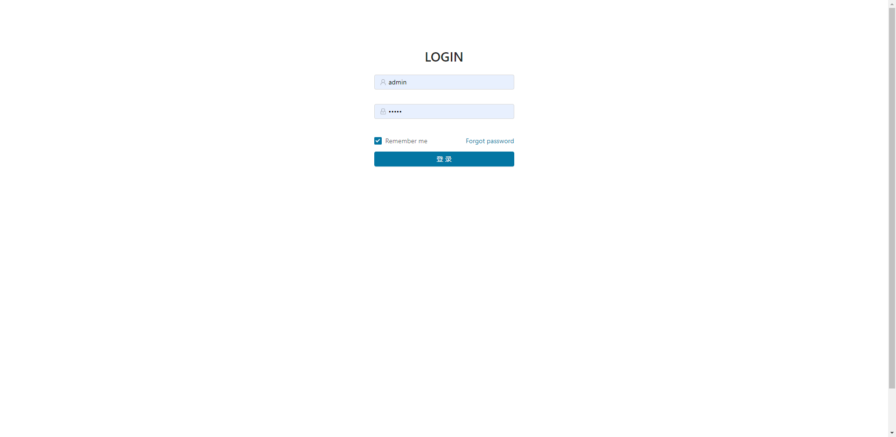
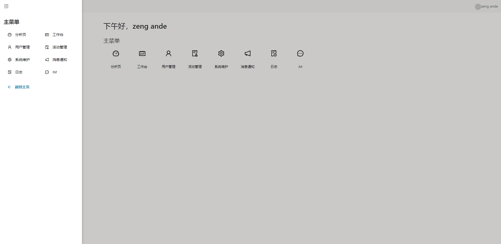

# 后台管理模板
使用 [antd](https://ant.design/docs/react/introduce-cn) + [umi](https://github.com/umijs/umi) + [dva](https://github.com/dvajs/dva) + [typescript](https://github.com/microsoft/TypeScript) 搭建的后台管理模板

## 截图
1. 登录页

2.主页
